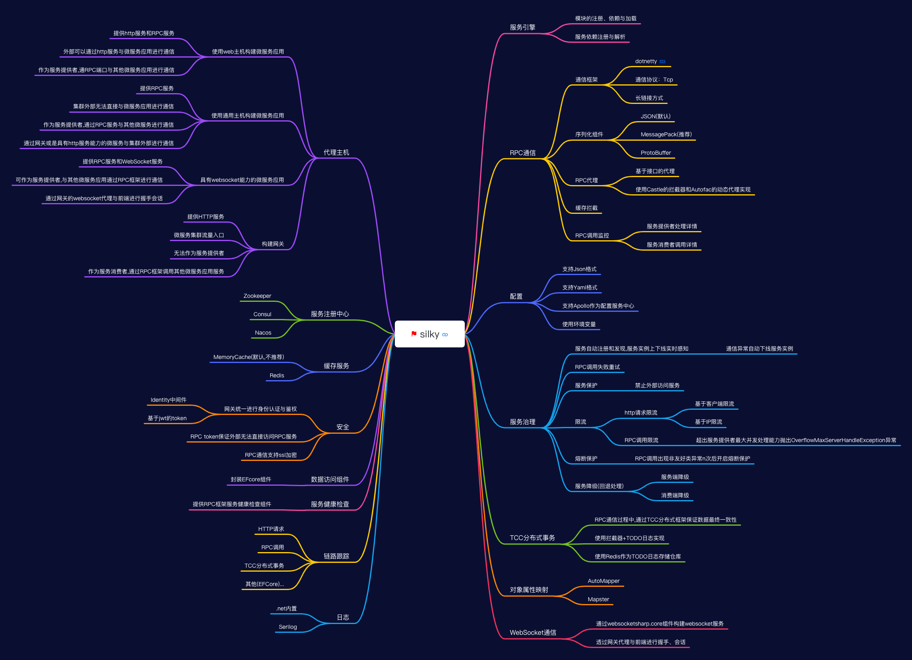

<p align="center">
  
</p>

# Silky 微服务框架
[](./LICENSE)
[](https://img.shields.io/github/last-commit/liuhll/silky)
[](https://www.nuget.org/packages/Silky.Core)
[](https://www.myget.org/feed/Packages/silky-preview)
[](https://www.nuget.org/packages/Silky.Core)
[](https://hits.seeyoufarm.com)

<div align="center">

**简体中文 | [English](./README.en-US.md)**

</div>

## 项目介绍


silky框架旨在帮助开发者在.net平台下,通过简单代码和配置快速构建一个微服务应用的开发框架。它提供了 **RPC通信** 与 **微服务治理** 两大关键能力。这意味着，使用 silky 开发的微服务，将具备相互之间的远程发现与通信能力， 同时利用 silky 提供的丰富服务治理能力，可以实现诸如服务发现、负载均衡、流量调度等服务治理诉求。同时 silky 是高度可扩展的，用户几乎可以在任意功能点去定制自己的实现，以改变框架的默认行为来满足自己的业务需求。

silky微服务有着如下的优势：
- 开箱即用
  - 简单易用,使用[通用主机](https://docs.microsoft.com/zh-cn/aspnet/core/fundamentals/host/generic-host?view=aspnetcore-5.0)或是[web主机](https://docs.microsoft.com/zh-cn/aspnet/core/fundamentals/host/web-host?view=aspnetcore-5.0)来构建(托管)微服务应用。
  - 易用性高，面向接口代理特性能实现本地透明调用。
  - 功能丰富，基于原生库或轻量扩展即可实现绝大多数的微服务治理能力。

- 超大规模微服务集群实践
  - 高性能的跨进程通信协议,使用[DotNetty](https://github.com/Azure/DotNetty)通信框架实现了基于接口代理的RPC框架，提供高性能的基于代理的远程调用能力，服务以接口为粒度，为开发者屏蔽远程调用底层细节。
  - 地址发现、流量治理层面，轻松支持规模化集群实例。

- 企业级微服务治理能力
  - 通过[Polly](https://github.com/App-vNext/Polly)实现的服务治理,提高服务的容错能力。
  - 内置多种负载均衡策略，智能感知下游节点健康状况，显著减少调用延迟，提高系统吞吐量。
  - 支持多种注册中心服务,服务实例上下线实时感知。

- 数据一致性的保证
  - 使用TCC分布式事务保证数据最终一致性。

## 框架特性



### 服务引擎+模块化设计

- 负责silky主机的初始化过程
- 负责模块解析、依赖管理与加载
- 服务注册与解析


### RPC通信

- 使用[Dotnetty](https://github.com/Azure/DotNetty)作为底层通信组件，使用TCP作为通信协议, 采用长链接方式提高系统吞吐量
- 基于接口的动态代理
- 支持JSON、MessagePack、ProtoBuf编解码方式
- RPC通信过程中支持缓存拦截,提高通信性能
- RPC调用监控

### 服务治理

- 服务自动注册和发现,服务实例上下线智能感知
- RPC调用失败重试
- 支持轮询、随机路由、哈希一致性等负载均衡路由方式, 智能感知下游节点健康状况，显著减少调用延迟，提高系统吞吐量。
- 支持HTTP限流和RPC调用限流
- 支持熔断保护,当发生非友好类异常n次后开启熔断保护
- 支持RPC调用的监视
- 服务降级,当RPC调用失败后调用`Fabllback`指定的方法达到服务容错的目的
- 通过配置支持禁止服务被外部访问

### 通过.net主机构建

- 使用web主机构建微服务应用
- 使用通用主机构建微服务应用
- 构建具有websocket能力的微服务应用
- 构建网关应用
  

### 安全设计

- 网关统一进行身份认证与鉴权
- rpc token用于保护RPC通信,保证外部无法直接访问rpc服务
- RPC通信支持ssl加密

### 多种配置方式

- 支持Json格式配置文件
- 支持Yaml格式配置文件
- 支持Apollo作为配置服务中心
- 使用环境变量

### 链路跟踪

- HTTP请求
- RPC调用
- TCC分布式事务
- 其他(EFCore)...

### 支持分布式事务

- RPC通信过程中,通过TCC分布式框架保证数据最终一致性
- 使用拦截器+TODO日志实现
- 使用 Redis作为TODO日志存储仓库

### 支持websocket通信

- 通过[websocketsharp.core](https://www.nuget.org/packages/websocketsharp.core/)组件构建websocket服务
- 透过网关代理与前端进行握手、会话

## 入门

- 通过[开发者文档](http://docs.silky-fk.com/silky/)学习Silky框架。
- 通过[silky.samples项目](http://docs.silky-fk.com/silky/dev-docs/quick-start.html)熟悉如何使用Silky框架构建一个微服务应用。
- 通过[配置](http://docs.silky-fk.com/config/)文档熟悉Silky框架的相关配置属性。


## 快速开始

### 1. 构建主机

新建一个web或是控制台项目,通过 nuget安装`Silky.Agent.Host`包。

```pwsh
PM> Install-Package Silky.Agent.Host
```

在`Main`方法中通过`HostBuilder`构建主机。

```csharp
public class Program
{
  public static Task Main(string[] args)
  {
    return CreateHostBuilder(args).Build().RunAsync();
  }

  private static IHostBuilder CreateHostBuilder(string[] args) =>
    Host.CreateDefaultBuilder(args)
      .ConfigureSilkyWebHostDefaults(webBuilder => { webBuilder.UseStartup<Startup>();});
   
}
```

在`Startup`中配置服务依赖注入，以及配置中间件。

```csharp
public void ConfigureServices(IServiceCollection services)
{
  services.AddSilkyHttpCore()
    .AddSwaggerDocuments()
    .AddRouting();
}

public void Configure(IApplicationBuilder app, IWebHostEnvironment env)
{
  if (env.IsDevelopment())
  {
    app.UseDeveloperExceptionPage();
    app.UseSwaggerDocuments();
  }

  app.UseRouting();

  app.UseEndpoints(endpoints => { endpoints.MapSilkyRpcServices(); });
}
```

### 2. 更新配置

在配置文件中指定服务注册中心的类型和服务注册中心配置属性以及`SilkyRpc`框架的配置。如果使用使用分布式事务必须要使用redis作为分布式缓存。

其中,在同一个微服务集群中,`Rpc:Token`的值必须相同。`Rpc:Port`的缺省值是`2200`,`Rpc:Host`的缺省值为`0.0.0.0`。

在`appsettings.json`中新增如下配置:

```json
  {
    "RegistryCenter": {
    "Type": "Zookeeper",
    "ConnectionStrings": "127.0.0.1:2181,127.0.0.1:2182,127.0.0.1:2183;127.0.0.1:2184,127.0.0.1:2185,127.0.0.1:2186"
  },
  "DistributedCache": {
    "Redis": {
      "IsEnabled": true,
      "Configuration": "127.0.0.1:6379,defaultDatabase=0"
    }
  },
  "Rpc": {
    "Token": "ypjdYOzNd4FwENJiEARMLWwK0v7QUHPW",
    "Port": 2200
  }
  }
```

### 3. 定义一个服务接口

一般地,我们需要将服务接口单独定义在一个项目中,方便被服务消费者引用。

创建一个接口,并通过`[ServiceRoute]`特性标识为该接口是一个应用服务。

```csharp
[ServiceRoute]
public interface IGreetingAppService
{   
    Task<string> Get();
}
```

### 4. 提供者实现服务

创建一个类,通过继承服务接口即可实现接口定义的方法。

```csharp
public class GreetingAppService : IGreetingAppService
{
  public Task<string> Get()
  {
    return Task.FromResult("Hello World");
  }
}
```


### 5. 消费者通过RPC远程调用服务

其他微服务应用只需要通过引用应用服务接口项目,通过接口代理与服务提供者通过`SilkyRpc`框架进行通信。

### 6. Swagger在线文档

运行程序后,打开浏览器,输入`http://127.0.0.1:5000/index.html` 即可查看swagger在线文档,并且通过api进行调试。


## 通过项目模板快速创建应用

silky提供了两个项目模板可以快速的创建应用，开发者可以根据需要选择合适的项目模板来创建应用。

```pwsh

# 以模块的方式创建微服务应用,适用于将所有的应用放在同一个仓库
> dotnet new --install Silky.Module.Template::3.0.2

# 以独立应用的方式创建微服务应用,将每个微服务应用单独存放一个仓库
> dotnet new --install Silky.App.Template::3.0.2
```

使用项目模板创建微服务应用。

```pwsh

dotnet new silky.app -in -p:i -n Demo

```


## 贡献
- 贡献的最简单的方法之一就是讨论问题（issue）。你也可以通过提交的 Pull Request 代码变更作出贡献。
